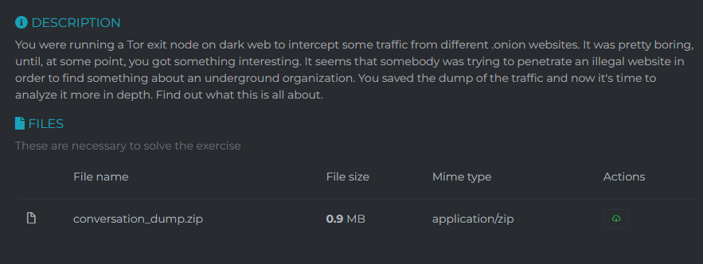
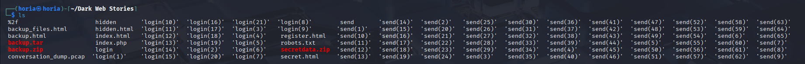

## Description 

## Solution 
I analysed the network dump that we got, first thing i did was trying to export http objects and it worked i got alot of files 

 
i noticed an interesting file secretdata.zip i tried unzipping it but it required a password
went back to the network dump and saw an uncrypted conversation between 2 people 

```
R1kS: Yo, are you here? Got something for you.

Charon VI: Hey, what's up?

R1kS: Was crawling on their website, 68b36d42880c527fb70086b1b97f4f34e49bc0d538f52607ec4009c552c2a63b.onion, or BlackVault as they call it. Managed to retrieve their sensitive documents, but somehow it's password protected and i cannot crack it using my regular tools.

Charon VI: Great job. Thought since the begining that they encrypt their files in case of a breakout.
Charon VI: Luckily, more or less, they were holding some of their passowrds in a database located on another server. Glad I was able to find it.

R1kS: That's very good. So, will you give me the password for this secret archive?

Charon VI: I will, but something is not right. There are multiple strings, and I don't understand what to do with them. Maybe you can find out.

R1kS: Sure. Drop 'em here. Those guys will finally learn Dark Web is not for everyone. They will not even know what struck them.

Charon VI: I will drop 'em one by one.
Charon VI: 5dbc98dcc983a70728bd082d1a47546e
Charon VI: f72c915d8f575a5c0999b5f37b6d99b7
Charon VI: a20bba554bfa1580a9d4aa2b6879ed46
Charon VI: 02beeea47ee3cfe212e6bd843b9ce7d3
Charon VI: 3112c7a8b6cd1677db0e3173e140fc05
Charon VI: 50f4646135205fd4a5417e460cf71d3c
Charon VI: eb22cfa0890a2df3177966854a7176bc
Charon VI: 845f49aa19c955b849d57593bf09d224
Charon VI: 87f63931da79aa969ac4a776ce6cfb03
Charon VI: 9793d9d6041c80f46ad7c1f530c8bbf8
Charon VI: 2f88d89a8f50426a6285449be3286708
Charon VI: 61bd22f017588208a0cacdf9a1a7ca1e
Charon VI: a7623c8b76316e10538782371b709415
Charon VI: c6cca42180caba17e9e6882dc66cc6ee 
Charon VI: 7c854900e46ebc5ee5680032b3e334de
Charon VI: ac81882b848b7673d73777ca22908c0d
Charon VI: 4ce97d67963edca55cdd21d46a68f5bb
Charon VI: 4abb62a00bccb775321f2720f2c7750b
Charon VI: 67e00e8ef738fe75afdb42b22e50371e
Charon VI: b561052e5697ee5f1491b5e350fb78e1
```
So i tought that the password had something to do with these hashes, i tried cracking the first few ones with an online cracking database 
```
5dbc98dcc983a70728bd082d1a47546e = $
f72c915d8f575a5c0999b5f37b6d99b7 = $u
a20bba554bfa1580a9d4aa2b6879ed46 = $up
02beeea47ee3cfe212e6bd843b9ce7d3 = $up3
```
after trying to decode the 5th one, it failed, 
I noticed a pattern tough each hash was the previous plus another letter 
```
import hashlib
import string
import sys

# Full hash chain (final hash is the full password)
hashes = [
    "5dbc98dcc983a70728bd082d1a47546e",
    "f72c915d8f575a5c0999b5f37b6d99b7",
    "a20bba554bfa1580a9d4aa2b6879ed46",
    "02beeea47ee3cfe212e6bd843b9ce7d3",
    "3112c7a8b6cd1677db0e3173e140fc05",
    "50f4646135205fd4a5417e460cf71d3c",
    "eb22cfa0890a2df3177966854a7176bc",
    "845f49aa19c955b849d57593bf09d224",
    "87f63931da79aa969ac4a776ce6cfb03",
    "9793d9d6041c80f46ad7c1f530c8bbf8",
    "2f88d89a8f50426a6285449be3286708",
    "61bd22f017588208a0cacdf9a1a7ca1e",
    "a7623c8b76316e10538782371b709415",
    "c6cca42180caba17e9e6882dc66cc6ee",
    "7c854900e46ebc5ee5680032b3e334de",
    "ac81882b848b7673d73777ca22908c0d",
    "4ce97d67963edca55cdd21d46a68f5bb",
    "4abb62a00bccb775321f2720f2c7750b",
    "67e00e8ef738fe75afdb42b22e50371e",
    "b561052e5697ee5f1491b5e350fb78e1"
]

# Build an extended charset (Unicode symbols and printable ASCII)
# You can add more Unicode blocks as needed
charset = ''.join(chr(i) for i in range(32, 127))  # ASCII printable
charset += ''.join(chr(i) for i in range(160, 256))  # Latin-1 Supplement
charset += '©®€£¥§¶†‡•–—‘’“”…‰™←↑→↓✓✔✕★☆'  # Common symbols

# Start with empty password and build up
password = ""

for i in range(len(hashes)):
    target_hash = hashes[i]
    if i == 0:
        # Looking for 1-char string that hashes to hashes[0]
        for c in charset:
            if hashlib.md5(c.encode('utf-8')).hexdigest() == target_hash:
                password = c
                print(f"[Step {i}] Found first character: {repr(c)}")
                break
        else:
            print("❌ Failed at step 0")
            sys.exit(1)
    else:
        for c in charset:
            attempt = password + c
            if hashlib.md5(attempt.encode('utf-8')).hexdigest() == target_hash:
                password = attempt
                print(f"[Step {i}] Found character: {repr(c)} -> {password}")
                break
        else:
            print(f"❌ Failed at step {i} (current: {repr(password)})")
            sys.exit(1)

print(f"\n✅ Final recovered password: {password}")
```
I used this script to decrypt the password and it worked 


I unzipped the file with it and got a png file


I used Zsteg on it and got the flag


## flag
```
UVT{4_l0T_0f_lay3r5_70_unc0v3r_1nn1t?}
```
