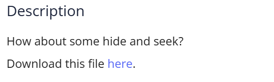
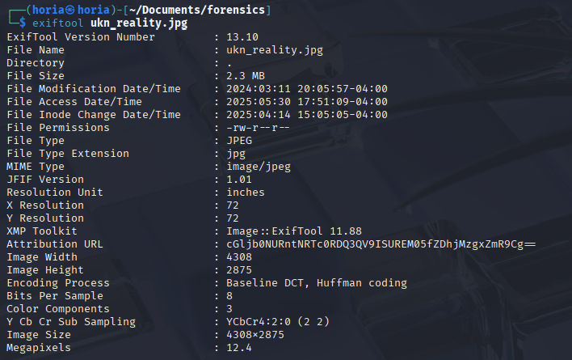
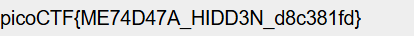

## Challenge Description



## Solution 

I unziped the picture, used exiftool on it and noticed a base64 string



``` cGljb0NURntNRTc0RDQ3QV9ISUREM05fZDhjMzgxZmR9Cg== ```

after decoding it I got the flag

 

