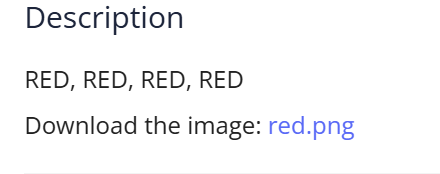
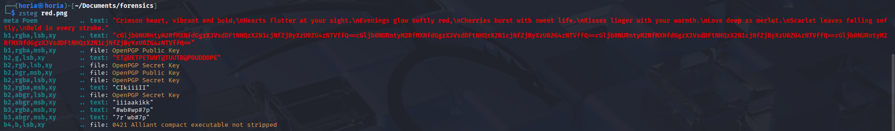
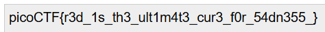

## Challange Description 


## Solution

Upon analyzing the image with zsteg i noticed an interesting string 



``` cGljb0NURntyM2RfMXNfdGgzX3VsdDFtNHQzX2N1cjNfZjByXzU0ZG4zNTVffQ== ``` 

I noticed it looked like base64 code so i decoded it using an online decoder and i got the flag




