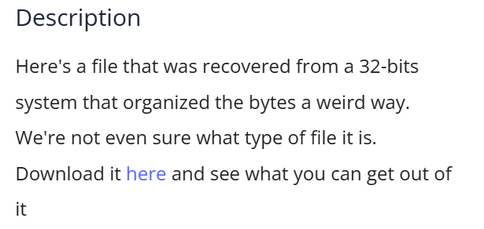
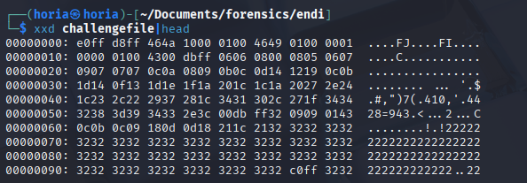

## Description


## Solution 

The initial indication that the system was 32-bit was a crucial hint. To analyze the file, I used `xxd` to examine its binary contents.



Observing the first bytes, they resembled the magic number commonly found in JPEG files:

```
FF D8 FF E0 00 10 4A 46 # Standard JPEG magic bytes
```

However, the file's actual initial bytes were:

E0 FF D8 FF 46 4A 10 00


This similarity suggested a pattern where every group of four bytes might have been reversed, swapping from most significant byte (MSB) to least significant byte (LSB) order.

To verify this hypothesis, I wrote a Python script that reverses each 4-byte word in the file:

```python
def swap_endianness_32bit(input_file, output_file):
    with open(input_file, 'rb') as f_in, open(output_file, 'wb') as f_out:
        while True:
            chunk = f_in.read(4)
            if len(chunk) < 4:
                break  # Ignore incomplete chunks
            f_out.write(chunk[::-1])  # Reverse bytes in 4-byte word

if __name__ == "__main__":
    input_path = "challengefile"
    output_path = "challengefile_swapped"
    swap_endianness_32bit(input_path, output_path)
    print(f"Swapped endianness saved to {output_path}")
