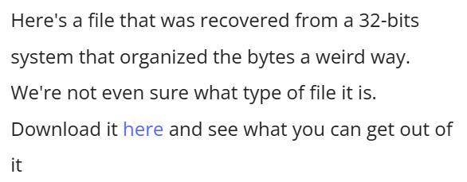

## Description


## Solution 

At first glance talking about a 32bit system was the biggest clue so i used xxd to view the bits of the file 


I checked the first bits they look like the magic bits of .jpeg extention 

```
 FF D8 FF E0 00 10 4A 46 magic bits of .jpeg
```
in the original file i had E0 FF D8 FF 46 4A 10 00 which was very similar 
my theory was that each 4 bytes were swapped from msb to lsb
I swapped the bytes with this python script and it worked 
```
def swap_endianness_32bit(input_file, output_file):
    with open(input_file, 'rb') as f_in, open(output_file, 'wb') as f_out:
        while True:
            chunk = f_in.read(4)
            if len(chunk) < 4:
                break  # Ignore incomplete word
            f_out.write(chunk[::-1])  # Reverse 4-byte word

if __name__ == "__main__":
    input_path = "challengefile"
    output_path = "challengefile_swapped"
    swap_endianness_32bit(input_path, output_path)
    print(f"Swapped endianness saved to {output_path}")
```
I opened the new file and got the flag 


